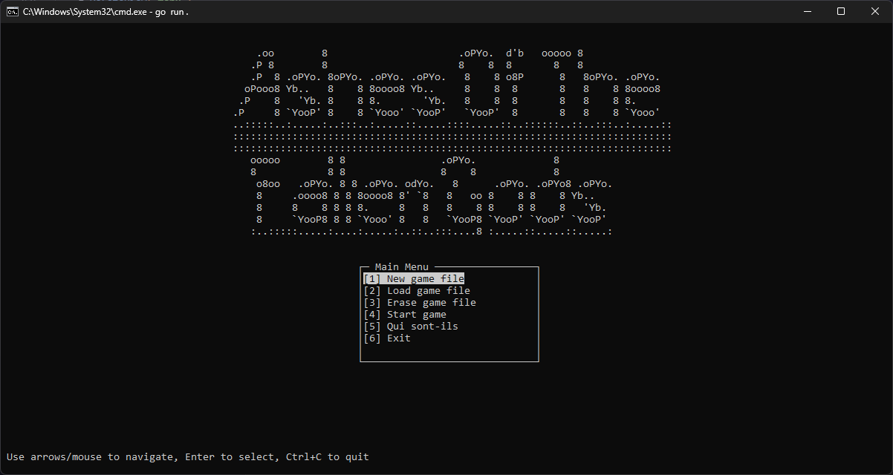
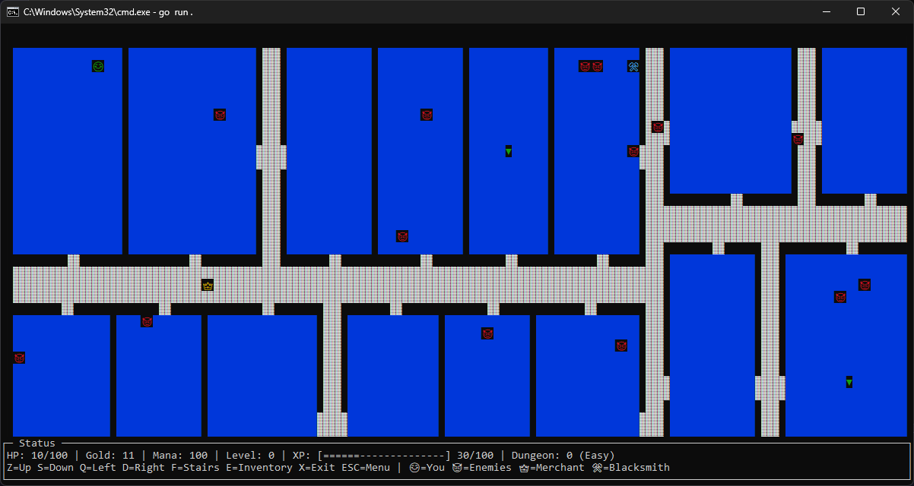

<div align="center">
  <h1 align="center">Ashes of the Forgotten Gods</h1>
  <p align="center">
    A minimalist action-exploration game project. Clean UI, moody world, pure gameplay.
    <br />
    <br />
    <a href="https://github.com/Askin242/projet-red_Ashes-of-the-Forgotten-Gods/issues">⚠️ Report Bug</a>
    ·
    <a href="https://github.com/Askin242/projet-red_Ashes-of-the-Forgotten-Gods/issues">💡 Request Feature</a>
  </p>
  <p align="center">
    
    
    
  </p>
  <p align="center">
    
  </p>
</div>

---

<p align="right">
  🇬🇧 English · 🇫🇷 <a href="./README.md">Français</a>
</p>

### 🎮 Overview

Ashes of the Forgotten Gods is a compact indie project focused on exploration and tight action. The experience aims for clarity and immersion with a clean, readable interface and minimal distractions.

### ✨ Features

- **Exploration** of a mysterious world
- **Intuitive UI** and streamlined menus
- **Action-first loop** focused on discovery and flow

### 🖼️ Screenshots

In-game:



### 🧰 Requirements

- Go (1.21+ recommended)
- Windows, macOS or Linux

### 🚀 Getting Started

1) Clone the repository

```bash
git clone https://github.com/Askin242/projet-red_Ashes-of-the-Forgotten-Gods.git
cd projet-red_Ashes-of-the-Forgotten-Gods/src
```

2) Fetch dependencies and run

```bash
go mod tidy
go run .
```

3) Build a binary (optional) (linux)

```bash
go build -o ashes
./ashes
```

### 🗂️ Project Structure 

- Root
  - `README.md` — project overview (FR)
  - `README.en.md` — project overview (EN)
  - `LICENSE` — license file
  - `main_menu.png`, `game.png` — screenshots
  - `docs/` — docs and planning (`GdP_RED.xlsx`)

- `src/`
  - `main.go` — program entrypoint
  - `go.mod`, `go.sum` — Go module files
  - `pkg/`
    - `display/` — rendering and screens (`display.go`, `game_menu.go`, `respawn.go`)
    - `fight/` — combat systems (core, QTE handler, rendering)
    - `gmgmap/` — map generation utilities and assets 
    - `save/` — configuration and save system
    - `structures/` — core game data structures (player, enemies, items, spells…)
    - `ui/` — UI flows and menus (`main_menu.go`, inventory, merchant, blacksmith, utils)
  - `saves/` — example save slots and JSON data

### 🙌 Credits

- **Game design & code**: [Sylvestre Graziani](https://github.com/Askin242) & [Matthieu Rey](https://github.com/MathCat975)
- **Map**: Edited version of  [gmgmap](https://github.com/cxong/gomapgen)

### 📜 License

MIT


