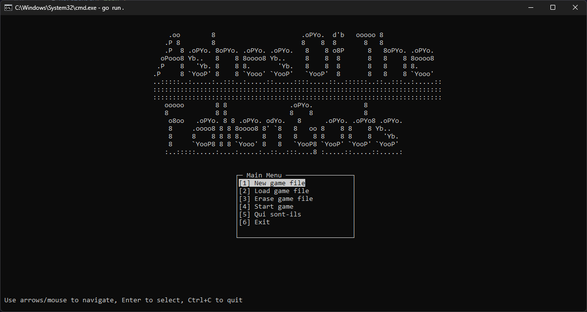
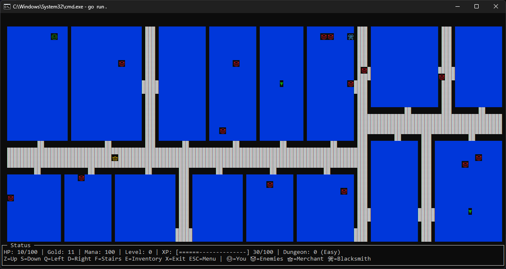

<div align="center">
  <h1 align="center">Ashes of the Forgotten Gods</h1>
  <p align="center">
    A minimalist action-exploration game project. Clean UI, moody world, pure gameplay.
    <br />
    <br />
    <a href="https://github.com/Askin242/projet-red_Ashes-of-the-Forgotten-Gods/issues">⚠️ Report Bug</a>
    ·
    <a href="https://github.com/Askin242/projet-red_Ashes-of-the-Forgotten-Gods/issues">💡 Request Feature</a>
  </p>
  <p align="center">
    
    
    
  </p>
  <p align="center">
    
  </p>
</div>

---

<p align="right">
  🇬🇧 <a href="./README.en.md">English</a> · 🇫🇷 Français
</p>

### 🎮 Aperçu

Ashes of the Forgotten Gods est un projet indépendant compact axé sur l'exploration et une action précise. L'expérience vise la clarté et l'immersion avec une interface lisible et sans distractions.

### ✨ Fonctionnalités

- **Exploration** d'un monde mystérieux
- **Interface intuitive** et menus simplifiés
- **Boucle d'action** centrée sur la découverte et le flow

### 🖼️ Captures d'écran

En jeu :



### 🧰 Prérequis

- Go (1.21+ recommandé)
- Windows, macOS ou Linux
⚠️ Ne pas lancé dans un `Terminal Windows 11`, Si vous etes sur Windows 11, lancé le cmd en Administrateur (vous ne devez pas avoir la bar avec les différents onglets)

### 🚀 Démarrage rapide

1) Cloner le dépôt

```bash
git clone https://github.com/Askin242/projet-red_Ashes-of-the-Forgotten-Gods.git
cd projet-red_Ashes-of-the-Forgotten-Gods/src
```

2) Récupérer les dépendances et lancer

```bash
go mod tidy
go run .
```

3) Construire un binaire (optionnel) (Linux)

```bash
go build -o ashes
./ashes
```

### 🗂️ Structure du projet 

- Racine
  - `README.md` — présentation du projet (FR)
  - `README.en.md` — présentation du projet (EN)
  - `LICENSE` — licence
  - `main_menu.png`, `game.png` — captures d'écran
  - `docs/` — documents et planification (`GdP_RED.xlsx`)

- `src/`
  - `main.go` — point d'entrée du programme
  - `go.mod`, `go.sum` — fichiers de module Go
  - `pkg/`
    - `display/` — rendu et écrans (`display.go`, `game_menu.go`, `respawn.go`)
    - `fight/` — systèmes de combat (noyau, gestion QTE, rendu)
    - `gmgmap/` — génération de cartes et assets 
    - `save/` — configuration et système de sauvegarde
    - `structures/` — structures de données du jeu (joueur, ennemis, objets, sorts…)
    - `ui/` — flux et menus UI (`main_menu.go`, inventaire, marchand, forgeron, utilitaires)
  - `saves/` — exemples de sauvegardes et données JSON

### 🙌 Crédits

- **Game design & code** : [Sylvestre Graziani](https://github.com/Askin242) & [Matthieu Rey](https://github.com/MathCat975)
- **Carte** : Version modifiée de [gmgmap](https://github.com/cxong/gomapgen)

### 📜 Licence

MIT
